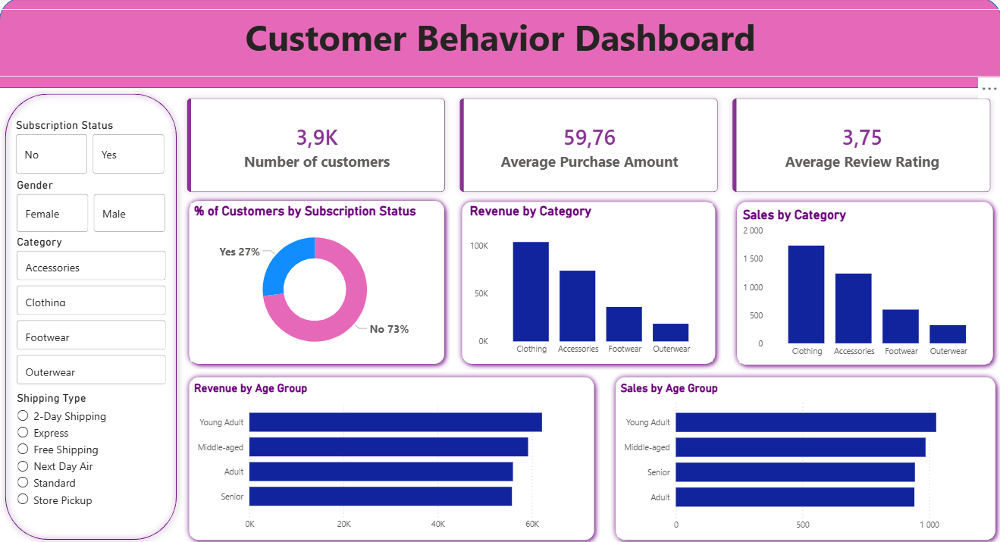

# 🛍️ Retail Customer Behavior & Segmentation Analysis | Python · SQL · Power BI

> Uncovering spending patterns, customer segments, and discount dynamics across 3,900 retail transactions to drive data-backed commercial strategy.

---

## 📋 Executive Summary

Analyzed 3,900 retail transactions across 18 variables to surface actionable insights into customer spending, loyalty, and product performance. Using Python for data wrangling, PostgreSQL for business query analysis, and Power BI for interactive visualization, the project identified that **80% of customers are Loyal**, male customers drive **2× more revenue** than female customers, and over **47–50% of purchases** for top items like Hats and Sneakers involve discounts — signaling margin risk. Recommendations focus on subscription growth, loyalty retention, and smarter discount targeting.

---

## ❓ Business Problem

Retail businesses often struggle to answer fundamental questions: *Who are our most valuable customers? Which products are driving revenue vs. being propped up by discounts? Are our subscriptions converting the right people?*

Without structured analysis, promotional spend is wasted, high-value segments go untargeted, and discount-dependent products erode margins silently. This project addresses those gaps by building a full analytics pipeline — from raw data to boardroom-ready recommendations.

---

## 🔬 Methodology

A three-stage analytical approach was used:

1. **Exploratory Data Analysis (Python)** — Data cleaning, feature engineering, and statistical profiling to understand the dataset's structure and quality.
2. **Business Query Analysis (SQL/PostgreSQL)** — Ten structured queries designed to answer specific commercial questions around revenue, segmentation, discounting, and subscriptions.
3. **Interactive Dashboard (Power BI)** — Visual synthesis of key metrics to enable stakeholder self-service exploration.

This layered approach ensures findings are both statistically sound and business-relevant.

---

## 🛠️ Technical Skills

| Layer | Tool / Technique |
|---|---|
| Data Wrangling | Python (`pandas`) — null imputation, column standardization, feature engineering |
| Feature Engineering | Age group binning, purchase frequency calculation, redundancy detection |
| Database | PostgreSQL — CTEs, window functions (`RANK()`), aggregations, subqueries |
| Visualization | Power BI — slicers, KPI cards, donut/bar charts, cross-filtering |
| Pipeline | Python → PostgreSQL integration via `sqlalchemy` |

**Advanced SQL techniques used:** `RANK() OVER (PARTITION BY ...)` for top-N per category, subquery-based average comparison for high-spender identification, and CASE-based customer segmentation logic.

---

## 📊 Results & Recommendations

### Key Findings

| # | Analysis | Finding |
|---|---|---|
| 1 | Revenue by Gender | Male customers generated **$157,890** vs. **$75,191** for female — a 2:1 ratio |
| 2 | High-Spending Discount Users | **839 customers** used discounts yet spent above the average purchase amount ($59.76) |
| 3 | Top Rated Products | Gloves (3.86), Sandals (3.84), and Boots (3.82) lead on customer satisfaction |
| 4 | Shipping Preference | Express shipping correlates with slightly higher average spend ($60.48 vs. $58.46 standard) |
| 5 | Subscription Impact | Only **27% of customers subscribe**, with near-identical avg. spend to non-subscribers ($59.49 vs. $59.87) |
| 6 | Discount-Dependent Products | Hats (50%), Sneakers (49.66%), and Coats (49.07%) have discount rates approaching 50% |
| 7 | Customer Segments | **3,116 Loyal**, 701 Returning, 83 New customers |
| 8 | Top Products per Category | Jewelry, Blouse, Sandals, and Jacket lead their respective categories |
| 9 | Repeat Buyers & Subscriptions | Of repeat buyers (>5 purchases), **2,518 are non-subscribers** vs. 958 subscribers — a conversion opportunity |
| 10 | Revenue by Age Group | Young Adults lead with **$62,143**, followed closely by Middle-aged ($59,197) |

### Actionable Recommendations

- 🔔 **Boost Subscriptions** — With 2,518 repeat buyers not subscribed, a targeted loyalty-to-subscription funnel could significantly grow the subscriber base. Promote exclusive perks (free shipping, early access) to convert high-frequency shoppers.
- 🏆 **Customer Loyalty Programs** — 80% of the customer base is already "Loyal." Introduce tiered rewards to deepen retention and increase average order value within this segment.
- ✂️ **Review Discount Policy** — Products like Hat, Sneakers, and Coat are discounted ~50% of the time. Introduce discount caps or "smart discount" triggers (e.g., cart abandonment only) to protect margins without losing volume.
- 🌟 **Product Positioning** — Leverage top-rated products (Gloves, Sandals, Boots) and category bestsellers (Jewelry, Blouse) prominently in marketing campaigns and homepage placements.
- 🎯 **Targeted Marketing** — Allocate budget toward Young Adults and Middle-aged segments, and consider premium messaging for Express shipping users who demonstrate higher willingness to spend.

---

## 📈 Dashboard Preview



The interactive dashboard includes:
- KPI cards: Total Customers (3.9K), Average Purchase ($59.76), Average Rating (3.75)
- Subscription status breakdown (27% Yes / 73% No)
- Revenue and Sales by Category and Age Group
- Slicers for Gender, Category, Subscription Status, and Shipping Type

---

## 🔭 Next Steps & Limitations

### What I'd Do Next
- **Predictive Modelling** — Build a churn/subscription propensity model using logistic regression or gradient boosting to score customers most likely to convert or churn.
- **Cohort Analysis** — Track customer spend over time to understand lifetime value (LTV) trajectories by segment.
- **Price Elasticity Analysis** — Model how discount depth affects purchase volume by product to optimize promotional strategy.
- **RFM Scoring** — Supplement the current segmentation with Recency-Frequency-Monetary scoring for more granular targeting.

### Limitations
- **No timestamps on individual transactions** — Prevents true time-series or trend analysis; findings reflect a static snapshot.
- **Missing Review Ratings (37 values)** — Imputed using category medians; may slightly smooth product-level rating differences.
- **Gender is binary** — The dataset only captures Male/Female, limiting demographic inclusivity in analysis.
- **No cost/margin data** — Revenue figures reflect gross purchase amounts; profitability analysis is not possible without COGS data.

---

## 📁 Repository Structure

```
├── data/
│   └── shopping_behavior_raw.csv
├── notebooks/
│   └── eda_cleaning.ipynb         # Python EDA & cleaning pipeline
├── sql/
│   └── business_queries.sql       # 10 PostgreSQL business analyses
├── dashboard/
│   └── customer_behavior.pbix     # Power BI dashboard file
└── README.md
```

---

*Analysis conducted on a dataset of 3,900 retail transactions across 18 features including demographics, purchase details, and behavioral signals.*
